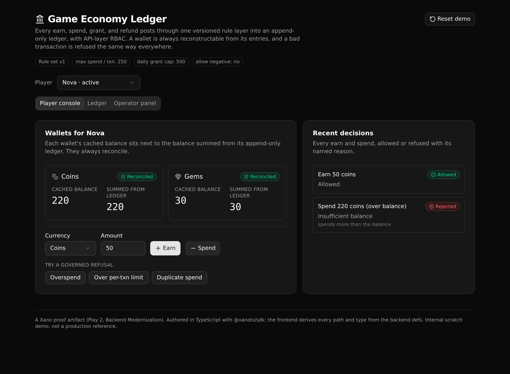

# Game Economy Ledger Backend

One governed rule layer for a game's virtual currency, posting every earn, spend, grant, and refund into an append-only ledger, with API-layer RBAC. A wallet is always reconstructable from its entries, and a bad transaction is refused the same way everywhere.



**6 tables, 12 endpoints, 3 API groups.** Authored in TypeScript with [`@xanots/sdk`](https://www.npmjs.com/package/@xanots/sdk). The React frontend derives every request path and type from the backend defs, so the two never drift.

## What it demonstrates

This is a Xano **Backend Modernization** proof (Play 2) for a gaming platform. A studio usually accumulates economy logic in scattered places: each mini game and store screen enforces its own balance checks, its own caps, its own idempotency. That is the legacy pattern this replaces.

Here the rules live in one readable API layer:

- **Balance sufficiency.** A spend that a wallet cannot cover is refused, unless the active rules allow a negative balance.
- **A per-transaction limit.** A spend over the configured ceiling is refused.
- **A daily grant cap.** An operator grant that would push a player past the rolling 24 hour cap is refused.
- **A duplicate guard.** Every write carries an idempotency key, so a retried request cannot post twice.
- **Refund reversal.** A refund reverses one spend exactly once. A second refund of the same spend is refused.
- **API-layer RBAC.** Grant, refund, and the audit log require an operator token. A player token is refused with 403, an anonymous request with 401. This is middleware and role checks at the API layer, not row-level security.

Two properties make the result auditable. The ledger is **append-only** (rows are only ever inserted, never changed), and each entry records the **rule version** that authorized it, so a past decision stays explainable after the rules change. The balance endpoint returns each wallet's cached balance next to a balance summed from its entries, which proves the two always match.

## Repo layout

```
xano/
  index.ts              the workspace: registers every table, group, and endpoint
  tables/               players, wallets, ledger_entries, economy_rules, audit_log, auth
  api/
    groups.ts           the three API groups (economy, auth, admin), canonical slugs pinned
    seed.ts             the demo reset path
    login.ts me.ts      native auth: mint a token, read the current role
    rules.ts players.ts balance.ts ledger.ts   the read endpoints
    earn.ts spend.ts grant.ts refund.ts        the governed writes
    audit.ts            the governance trail
  xano.lock             pinned object identities (committed)
frontend/
  src/lib/api.ts        the one contract: paths and types derived from the query defs
  src/components/       the player console, ledger view, and operator panel
docs/                   the landing page and screenshot
```

## API surface

Public paths are `api:<group>/<name>`.

| Verb | Path | What it enforces |
| --- | --- | --- |
| POST | `api:economy/seed` | Resets to a known demo state (rules, players, wallets, operators) |
| POST | `api:auth/login` | Verifies credentials, mints a token, returns the role |
| GET | `api:auth/me` | The current user and role (token required) |
| GET | `api:economy/rules` | The active rule set |
| GET | `api:economy/players` | Players and their wallets |
| GET | `api:economy/balance` | Cached balance next to the balance summed from the ledger |
| GET | `api:economy/ledger` | A player's append-only entries, newest first |
| POST | `api:economy/earn` | Credits currency (positive amount, first-seen idempotency key) |
| POST | `api:economy/spend` | Debits currency (balance, per-transaction limit, idempotency) |
| POST | `api:economy/grant` | Operator only; enforces the rolling daily grant cap |
| POST | `api:economy/refund` | Operator only; reverses a spend once, never twice |
| GET | `api:admin/audit` | Operator only; every allowed and rejected action with its reason |

A governed write always returns a decision (HTTP 200 with an `outcome` of `allowed` or `rejected` and a named `reason_code`) and writes one audit row. Bad input, a missing token, and the wrong role return 400, 401, and 403.

## Quick start

You need Node 20 or newer and a Xano account.

```sh
git clone https://github.com/xano-scratch/game-economy-ledger-backend
cd game-economy-ledger-backend
npm install
npx xanots login            # authenticate once
npm run xano:deploy         # builds, deploys the backend and frontend, prints the live URL
```

Open the printed static URL. The app seeds itself on first load, so you land on three players with wallets you can earn, spend, grant, and refund against. The Reset button reloads the demo state at any time.

Local development:

```sh
npm run dev                 # the frontend on http://127.0.0.1:5173
npm run typecheck           # tsc --noEmit
```

Point local dev at a deployed backend by setting `VITE_XANO_HOST` in a `.env.local` at the repo root (see `.env.example`).

## How a spend is decided

`spend` reads the active rules and the wallet, then checks in order: a repeat idempotency key is refused `duplicate_txn`; an amount over the per-transaction limit is refused `over_txn_limit`; a balance that cannot cover it (with negative balances off) is refused `insufficient_balance`. Only an allowed spend appends a ledger entry and updates the cached balance. Either way, one audit row is written with the outcome and the rule version. Grant and refund follow the same shape with their own rules.

## FAQ

**Is the ledger really append-only?** Yes. No endpoint updates or deletes a ledger row. A refund is a new positive entry that points at the spend it reverses; the original spend is untouched.

**Where does the balance come from?** Each wallet keeps a cached balance that every mutation updates. The balance endpoint also sums the wallet's ledger entries and returns both, so you can confirm they match.

**How is auth modeled?** A native Xano auth table backs identity. Login mints a token, and grant, refund, and audit name that table as their auth requirement and check the role. Access is enforced at the API layer, not with row-level security.

**Is this production ready?** No. It is an internal scratch proof artifact that shows one governed rule layer over money-like state. It is not a production reference and carries no real credentials.
